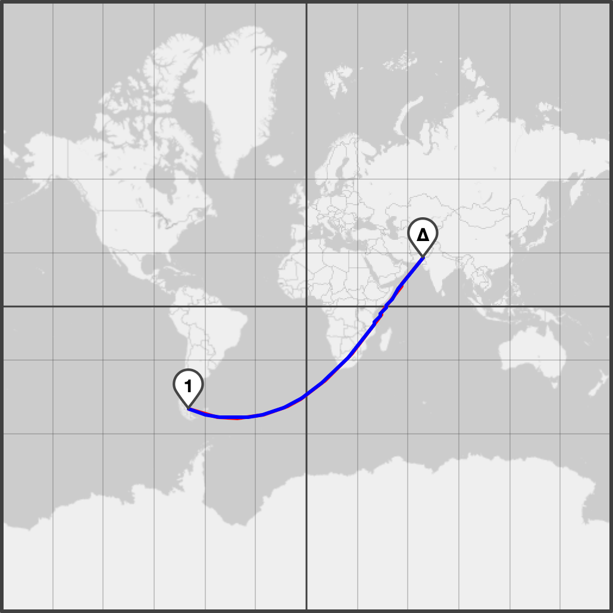
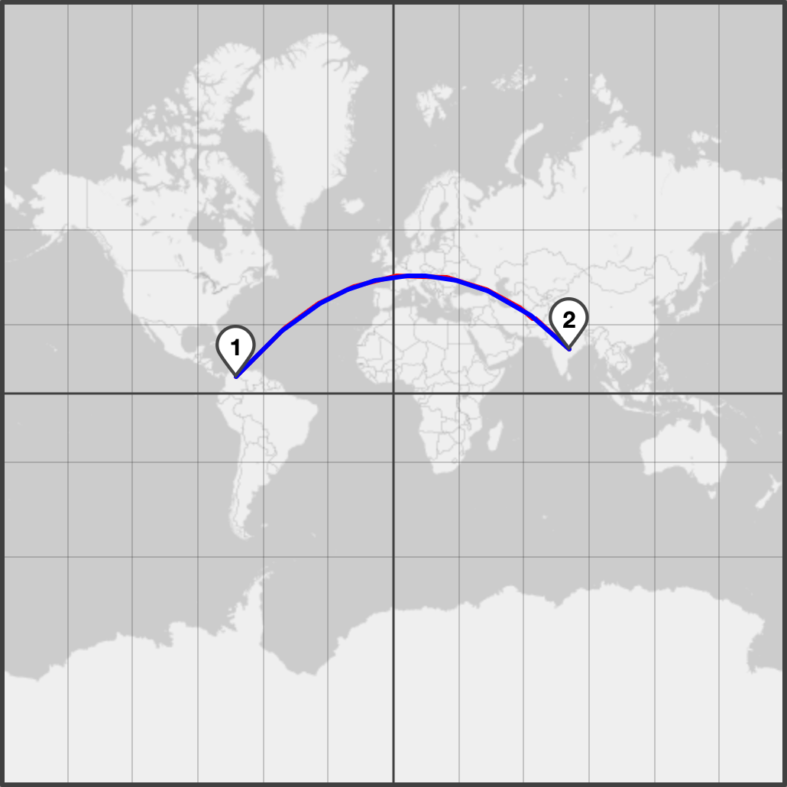
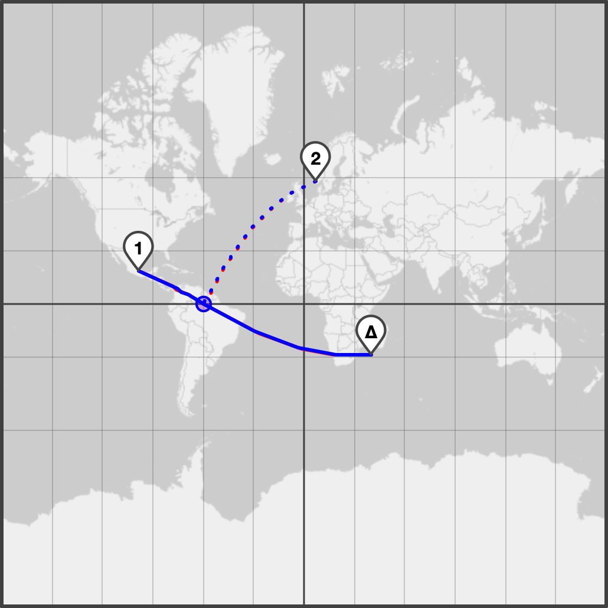
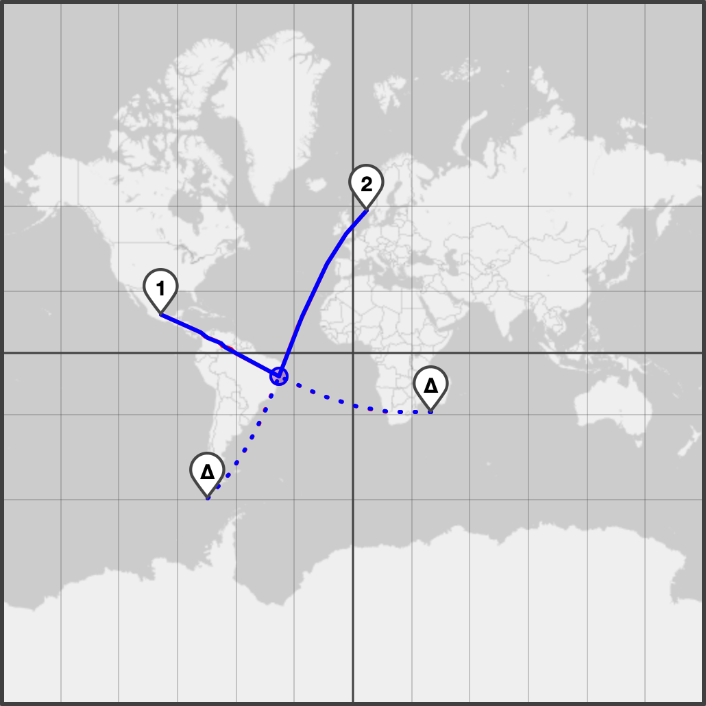
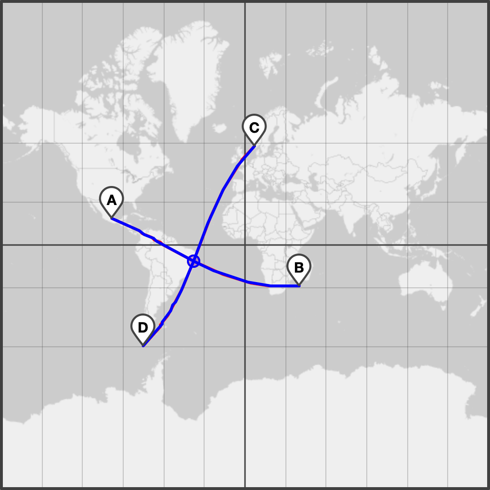
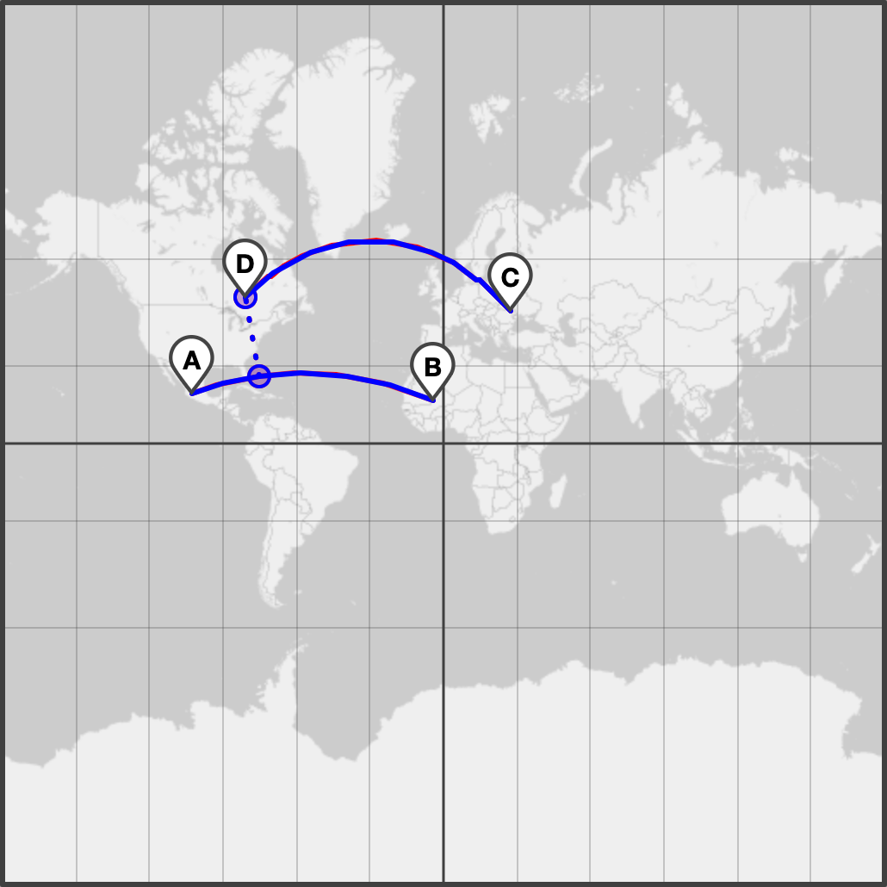
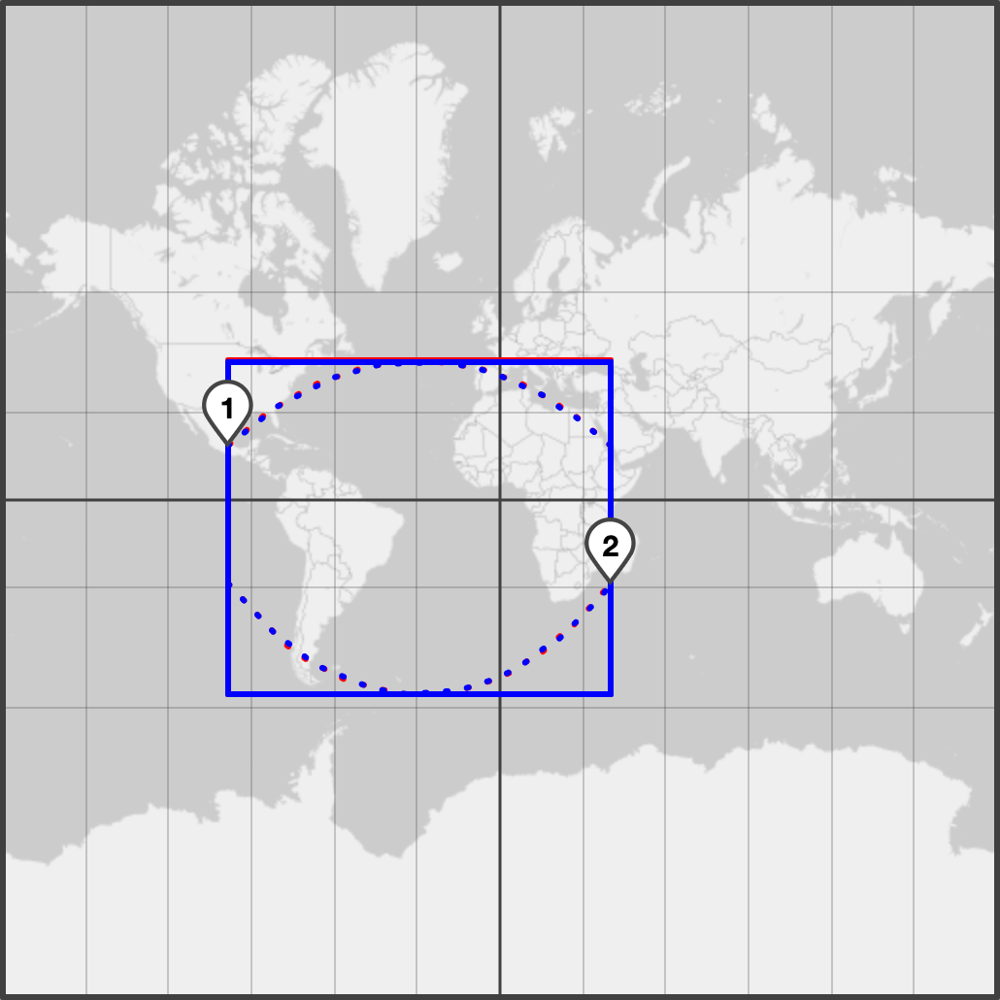
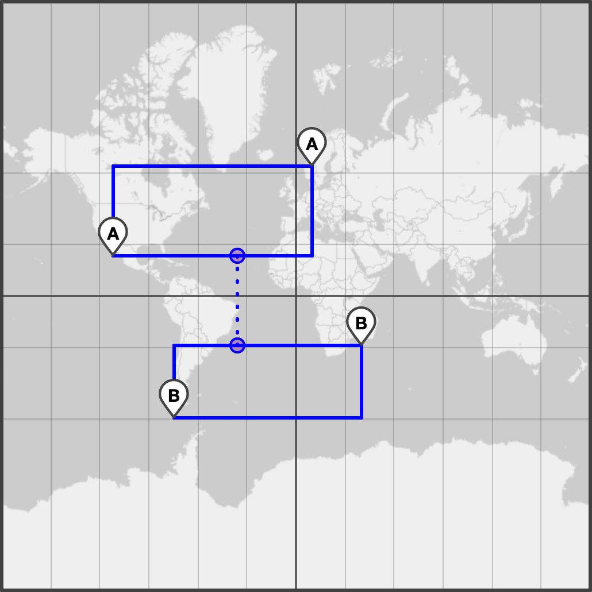

# GeoKit

Various geodesic calculations for C

This library includes a few classic formulas (direct, inverse, track) and 
introduces some new ones (intercept, intersect, equibox, equipath).

[Online demo](https://tidwall.com/geokit)

All functions work in spherical or ellipsoid mode.

## direct

The direct function takes a point, an initial azimuth, and a distance.
From those it determines a destination point and the final azimuth 
continuing further along the geodesic path.

## inverse

The inverse function takes two points and returns the distance from point 1 to
point 2, the initial azimuth from point 1 moving in the direction towards point
2, and the final azimuth from point 2 continuing further along the geodesic
path.

## track

The track function takes a geodesic path and a point, and returns the
cross-track and along-track distances.
Cross-track is the distance from the point to the path.
Along-track is how far the point is along the path.  
In other words, this function determines the shortest distance from a point to
a path.

## intercept

The intercept function takes two geodesic paths and returns the cross-intercept
and along-intercept distances.
Cross-intercept is the distance from path 2 to path 1. Along-intercept is the
distance from path 1 to path 2.  
For example, imagine two airplanes starting at different positions, moving in
different directions.
This function determines where their paths cross.

## intersect

The intersect function takes two geodesic segments and returns their point of
intersection.

## nearest

The nearest function takes two geodesic segments and determines the
shortest connecting path.
This can be used to get the distance and closest point of
intersection between two segments.

## equibox

The equibox function takes two points and calculates the extents
of an equirectangular bounding box that is able to fully contain
any geodesic within its bounds.  
This can be useful for when you need to do operations that intermix
flat map with geodesic, such as intersection detection using
equirectangular boxes on a geometry that has geodesic edges, or for
searching tree-based structures for geodesic geometries.

## equipath

The equipath function takes two equirectangular boxes and calculates
the nearest geodesic path. 
Similar to the equibox function, this allows for operations that 
intermix flat map with geodesics, such as kNN (k-nearest neighbors).

## Acknowledgments

The inverse and direct ellipsoidal formulas come from the
[geographiclib](https://geographiclib.sourceforge.io/) by Charles Karney.  
The spherical track operation comes from formulas found in the [geodesy](https://www.movable-type.co.uk/scripts/geodesy-library.html) library by [Chris Veness](https://github.com/chrisveness).
